# KernelPort

**KernelPort** is a high-performance inference server that lets you run models
from TensorFlow, PyTorch, ONNX, and TensorRT **without giving up their native GPU kernels**.

Bring your kernels with you. Serve them from one runtime.

---

## Why KernelPort?

Most inference servers force you into a single runtime or a lowest-common-denominator
format. KernelPort takes a different approach:

- **Native execution**: TensorFlow runs with TensorFlow kernels. PyTorch runs with PyTorch kernels.
- **GPU-first design**: Built for CUDA streams, batching, and memory reuse.
- **One server, many backends**: ONNX Runtime, TensorRT, LibTorch, TensorFlow.
- **Production-grade**: Dynamic batching, scheduling, backpressure, observability.

KernelPort is written in **Rust** for safety, performance, and predictable latency.

---

## What KernelPort Is (and Is Not)

**KernelPort is:**
- An inference *orchestrator* with pluggable execution backends
- A way to consolidate heterogeneous model stacks into one serving plane
- A system designed for low-latency, high-throughput GPU inference

**KernelPort is not:**
- A training framework
- A model compiler
- A replacement for TensorFlow or PyTorch

---

## Core Concepts

### Native Backend Execution
KernelPort does not reimplement ML frameworks. Instead, it embeds and orchestrates
their production runtimes:

| Backend | Execution |
|------|----------|
| PyTorch | LibTorch (TorchScript / compiled artifacts) |
| TensorFlow | TensorFlow C API (SavedModel) |
| ONNX | ONNX Runtime (CUDA / TensorRT EP) |
| TensorRT | Native TensorRT engines |

This ensures you get:
- Vendor-optimized kernels
- Framework correctness
- No silent performance regressions

### Helion (Experimental)
KernelPort can proxy Helion kernels via a Python sidecar. This keeps the Rust
server lean while letting MLEs author kernels in Helion (higher-level Triton with
autotuning).

Sidecar flow (v0):
- Run the Helion gRPC worker in Python (see `scripts/helion/helion_worker.py`).
- Start kernelportd with `--backend helion --helion-addr http://127.0.0.1:50061`.
- Send standard KernelPort gRPC requests to `kernelportd`; it forwards to Helion.
- Expect a first-run autotune warm-up (can be minutes depending on kernel/search).

Planned follow-up:
- Optional in-process Helion embedding (pyo3) for lower per-request latency.

Helion worker Python deps (uv):
```bash
uv venv .venv
source .venv/bin/activate
uv pip install "torch==2.9.*" --index-url https://download.pytorch.org/whl/cu126
uv pip install helion grpcio grpcio-tools numpy
```

Helion sidecar (Docker) build/run:
```bash
docker build -f Dockerfile.gpu -t kernelport:gpu .
docker build -f Dockerfile.helion -t kernelport-helion:gpu .
docker compose up --build
```

Bring it down:
```bash
docker compose down
```

GPU pinning and cache:
- Pin GPUs with `CUDA_VISIBLE_DEVICES` in each container (e.g. helion worker uses `0`, kernelport uses `0` or a different GPU).
- Persist Helion autotune artifacts by mounting a volume to the worker cache dir (e.g. set `XDG_CACHE_HOME=/cache` and mount `-v /path/to/cache:/cache`).

Example request (replace base64 data as needed):
```bash
grpcurl -plaintext -d '{
  "model": "demo",
  "inputs": [
    { "name": "x", "dtype": "F16", "shape": [4, 8], "data": "<BASE64>" }
  ]
}' localhost:50051 kernelport.v1.InferenceService/Infer
```

Generate base64 payload:
```bash
python - <<'PY'
import base64
import torch
x = torch.randn(4, 8, dtype=torch.float16)
print(base64.b64encode(x.numpy().tobytes()).decode())
PY
```

CPU-only mock Helion (Docker, see `scripts/helion/mock/`):
```bash
docker compose -f docker-compose.mock.yml up --build
```

---

### Dynamic Batching
Requests are dynamically batched per model and shape:
- Configurable max batch size
- Tight batching windows (ms-level)
- Shape-aware grouping

This improves GPU utilization without sacrificing latency SLAs.

---

### GPU-Aware Scheduling
KernelPort schedules work across:
- GPUs (or MIG slices)
- CUDA streams
- Backend-specific execution contexts

The scheduler can be tuned for:
- Throughput
- Latency
- Fairness across models or tenants

---

## Architecture (High Level)





---

## Local Development

### Local Python (venv)

For the Python pieces (e.g. `make test-python`, pre-commit Python hook, `model_fetch.py`, or
Helion/LuxTTS workers), use a venv so your system Python setup doesn't conflict:

```bash
uv venv .venv
source .venv/bin/activate   # or  .venv\Scripts\activate  on Windows
uv pip install pyyaml
```

Then run `make test-python` or `pre-commit run --all-files`; the hook will use the active venv.
To run the Helion worker locally, add: `uv pip install "torch==2.9.*" helion grpcio grpcio-tools numpy`
(see Helion section for PyTorch index). For LuxTTS, use the Docker setup or install from the
LuxTTS repo requirements.

### CPU (macOS or Linux)

- Install Rust components: `rustup component add rustfmt clippy`
- Run checks: `make check`
- Run the server:
  - `cargo run -p kernelport-server -- serve --device cpu`
- ORT identity test (CPU): `cargo test -p kernelport-backend-ort --test identity`

### CUDA (Linux + NVIDIA)

KernelPort supports CUDA via ONNX Runtime. For GPU inference:

- Provide a CUDA-enabled ONNX Runtime shared library (build from source or use a CUDA-enabled package).
- Set `ORT_DYLIB_PATH` to the CUDA-enabled `libonnxruntime.so`.
- Build with the CUDA feature and select a device:
  - `cargo run -p kernelport-server --features ort-cuda -- serve --device cuda:0`

---

## Containers (CPU and GPU)

KernelPort ships with separate Dockerfiles for CPU and GPU runtime environments:

- `Dockerfile.cpu` builds a CPU-only image intended for local dev or CPU deployments.
- `Dockerfile.gpu` builds a GPU-ready image that expects CUDA + TensorRT on the host.
  - Base image: `nvidia/cuda:12.2.0-runtime-ubuntu22.04`

The GPU image is designed for "bring your own kernel" by letting you mount a
CUDA-enabled ONNX Runtime shared library at runtime:

- Mount your `libonnxruntime.so` and set `ORT_DYLIB_PATH`.
- Run with `--gpus` and choose `--device cuda:N`.

### Recommended NVIDIA stack

- Driver: 535+ (or newer)
- CUDA: 12.2
- cuDNN: 8.9
- TensorRT: 8.6

### Build

```bash
docker build -f Dockerfile.cpu -t kernelport:cpu .
docker build -f Dockerfile.gpu -t kernelport:gpu .
```

### Run (CPU)

```bash
docker run --rm -p 8080:8080 kernelport:cpu --device cpu
```

### Run (CPU + HF pull)

```bash
docker run --rm -p 8080:8080 \
  -e MODEL_MANIFEST_PATH=/app/models/manifest.yaml \
  -e HF_TOKEN=your_hf_token \
  -v /path/to/manifest.yaml:/app/models/manifest.yaml:ro \
  -v /path/to/model-cache:/models \
  kernelport:cpu --device cpu --model-path /models/bert-base-uncased/model.onnx
```

### Run (GPU)

```bash
docker run --rm --gpus all \
  -e ORT_DYLIB_PATH=/opt/ort/libonnxruntime.so \
  -v /path/to/ort/libonnxruntime.so:/opt/ort/libonnxruntime.so:ro \
  -p 8080:8080 \
  kernelport:gpu --device cuda:0 --model-path /models/bert-base-uncased/model.onnx
```

### Run (GPU + HF pull)

```bash
docker run --rm --gpus all \
  -e ORT_DYLIB_PATH=/opt/ort/libonnxruntime.so \
  -e MODEL_MANIFEST_PATH=/app/models/manifest.yaml \
  -e HF_TOKEN=your_hf_token \
  -v /path/to/ort/libonnxruntime.so:/opt/ort/libonnxruntime.so:ro \
  -v /path/to/manifest.yaml:/app/models/manifest.yaml:ro \
  -v /path/to/model-cache:/models \
  -p 8080:8080 \
  kernelport:gpu --device cuda:0 --model-path /models/bert-base-uncased/model.onnx
```

See `docs/model-ingestion.md` for the HuggingFace model ingestion plan and
`docs/model-manifest.md` for the proposed manifest schema.

Validation steps are in `docs/validation.md`.

### Deployments and secrets

For deployment options (LuxTTS, Lambda Cloud, GHCR) and required secrets, see
[docs/deployments.md](docs/deployments.md). Summary:

- **LuxTTS**: Set `HUGGINGFACE_HUB_TOKEN` (or `HF_TOKEN`) when running the LuxTTS worker.
- **Lambda Cloud deploy** (GitHub Actions): Add repository secrets
  **LAMBDA_CLOUD_API_KEY** and **HUGGINGFACE_HUB_TOKEN** in
  Settings → Secrets and variables → Actions.

### Deploy to Lambda Cloud

The GitHub Actions workflow **Deploy to Lambda Cloud** builds the kernelport and LuxTTS
images, pushes them to GHCR, and launches a GPU instance on [Lambda Cloud](https://cloud.lambda.ai/).

1. **Secrets** (one-time): In the repo go to **Settings → Secrets and variables → Actions**.
   Add **LAMBDA_CLOUD_API_KEY** and **HUGGINGFACE_HUB_TOKEN**.

2. **SSH key** (one-time): In [Lambda Cloud SSH keys](https://cloud.lambda.ai/ssh-keys), add
   an SSH key and note its **name** (e.g. `macbook-pro`). The workflow needs this name.

3. **Run the workflow**: Push your branch, then go to **Actions → Deploy to Lambda Cloud →
   Run workflow**. Fill the inputs:
   - **instance_type_name**: e.g. `gpu_1x_a100` (see [Lambda instance types](https://cloud.lambda.ai/instances)).
   - **region_name**: e.g. `us-tx-1`.
   - **ssh_key_name**: the exact name of your SSH key from step 2 (required).

4. **After the run**: The job summary shows the **instance ID** and **public IP**. SSH into
   the instance and run your stack (e.g. pull images from GHCR and run docker compose with
   `HUGGINGFACE_HUB_TOKEN`). The gRPC inference endpoint is **`<instance-ip>:50051`** once
   the stack is running.

See [.github/workflows/deploy-lambda.yml](.github/workflows/deploy-lambda.yml) and
[docs/deployments.md](docs/deployments.md) for details.

## Pre-commit (local)

Install pre-commit and enable the hook:

```bash
pipx install pre-commit
pre-commit install
```

Hooks run: `cargo fmt`, `cargo test --all`, and Python script tests (`manifest_to_serve_args`).
The Python hook requires PyYAML; using a venv is recommended (see [Local Python (venv)](#local-python-venv)).

Run on demand:

```bash
pre-commit run --all-files
```

Run only Python script tests: `make test-python` (requires PyYAML).
